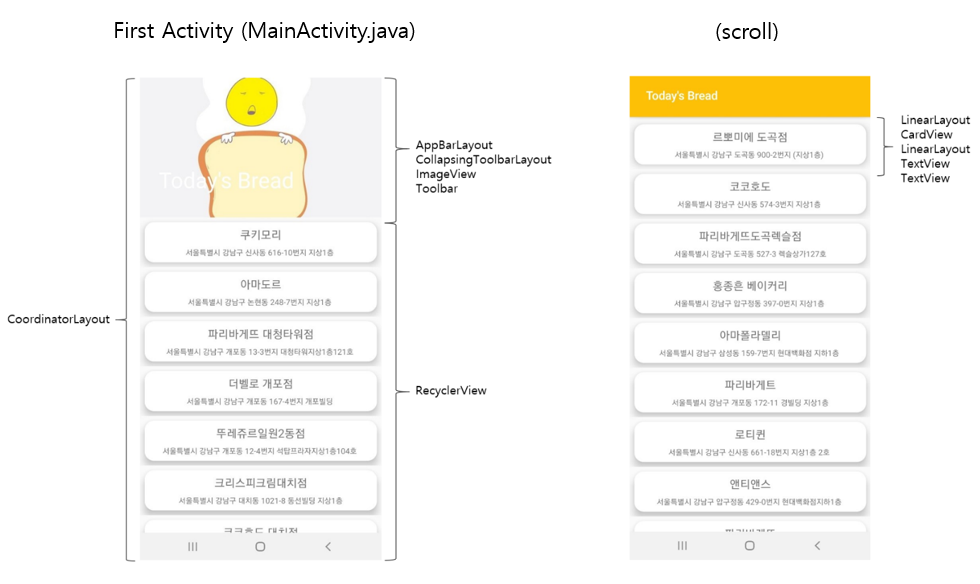
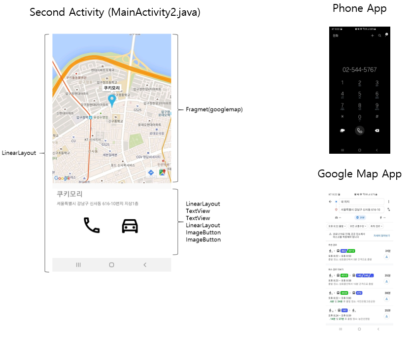
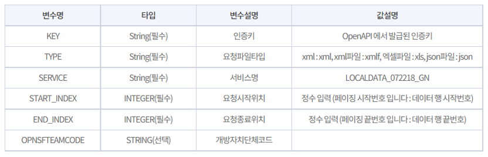
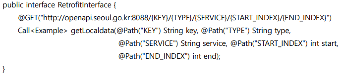
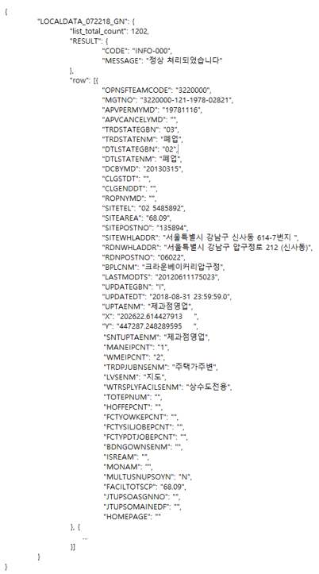
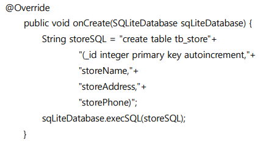
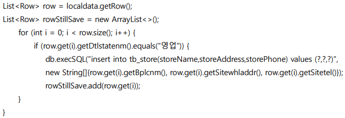
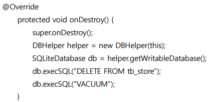
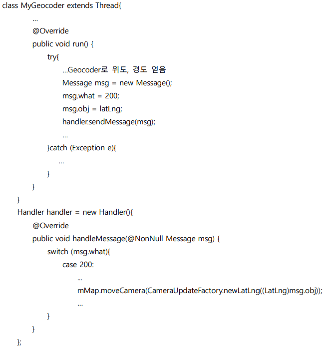

# "강남's bread" Android Application  
### 1. 전체 요약  
### **[강남's bread]**  
##### 서울시 강남구 소재 제과점을 소개해줍니다. 제과점의 위치, 연락처, 길찾기를 서비스합니다.  
### **[Application 화면 설계]**  
  
### **[사용 핵심 skill 및 지식]**  
  
### 2. 프로젝트 설명  
##### **[프로젝트명]** ‘강남’s bread’ 안드로이드 앱 개발 프로젝트  
##### **[프로젝트 소개]** ‘서울 열린 데이터 광장’에서 제공하는 ‘서울특별시 강남구 제과점영업 인허가 정보’ OpenAPI로 강남구 소재 제과점 정보를 활용합니다. 사용자는 안드로이드 앱을 통해 제과점을 소개받고 선택한 제과점의 위치와 전화번호, 길찾기 서비스를 이용할 수 있습니다. 매 실행마다 약 30개 제과점을 추천 받습니다.  
##### **[프로젝트 기간]** 21.07.12 ~ 21.07.21  
##### **[개발 환경 및 언어]** AndroidStudio/Java  
##### **[상세업무]** (UI/OpenAPI/SQLiteDatabase/GoogleMap/Others)  
### 2-1) UI  
  
##### -AppBar와 RecyclerView의 상호 작용 위해 CoordinatorLayout 사용  
##### -AppBar에 ImageView와 Toolbar를 사용해 이미지와 제목 삽입  
##### -CollapsingToolbarLayout으로 스크롤 시 AppBar의 변형 모습 설정  
##### -ListView의 findViewById 성능 이슈, 쉬운 커스터마이징을 위해 RecycerView를 사용  
##### -CardView를 사용해 그림자 효과 부여  
##### -원하는 제과점 클릭 시 Second Activity 화면 등장  
  
##### -Google Map을 사용하기 위한 fragmemt
##### -해당 제과점의 상호명과 주소를 TextView에 그림
##### -전화 버튼 클릭 시 Phone App으로 연결, 자동차 버튼 클릭 시 Google Map App으로 연결되어 길찾기 서비스 이용 가능  
### 2-2) OpenAPI  
##### -서울 열린데이터 광장: 서울특별시 강남구 제과점영업 인허가 정보  
##### -요청인자  
  
##### -Http 통신을 위해 Retrofit2 사용  
  
##### -JSON  
  
##### -Retrofit2의 컨버터(Convertor)로 Gson 사용  
##### -데이터를 담기 위해 POJO 생성  
### 2-3) SQLiteDatabase  
##### -Http통신으로 받아온 데이터 중 제과점 이름, 주소, 번호를 데이터베이스에 저장 (MainActivity.java에서 얻은 데이터를 MainActivity2.java에서도 사용하기 위해)
  
##### -“영업” 중인 제과점만 선별  
  
##### -MainActivity.java 즉, Fist Activity가 onDestroy()될 때 Database의 해당 테이블을 비움 (First Activity의 onCreate()가 실행될 때마다 약 30개의 새 데이터를 보여주기 위해/메모리 공간 효율 위해)
  
### 2-4) GoogleMap  
##### -제과점 주소만 제공하는 관계로 Geocoder 사용해 위도, 경도 얻음  
##### -Geocoder 사용 위해 개발자 thread 발생  
##### -개발자 thread의 UI(지도) 작업 위한 handler 사용  
  
### 2-5) Others  
##### Permission  
##### uses-permission android:name="android.permission.INTERNET"  
##### uses-permission android:name="android.permission.CALL_PHONE"
