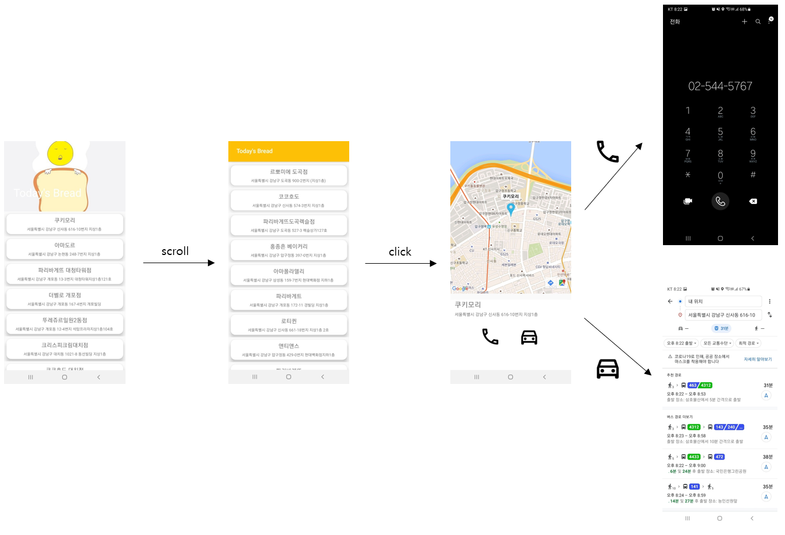
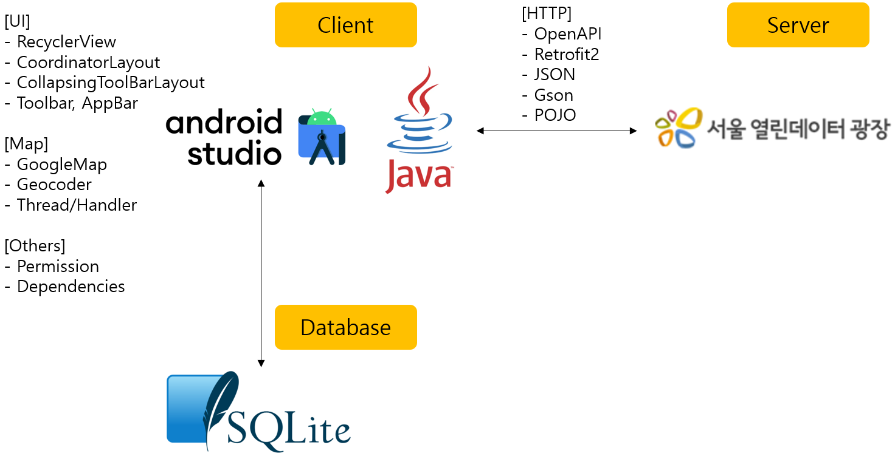

## "강남's bread" Android Application  
### 1. 전체 요약  
##### **[강남's bread]** 서울시 강남구 소재 제과점을 소개해줍니다. 제과점의 위치, 연락처, 길찾기를 서비스합니다.  
##### **[Application 화면 설계]**  
  
##### **[사용 핵심 skill 및 지식]**  
  
### 2. 프로젝트 설명  
##### **[프로젝트명]** ‘강남’s bread’ 안드로이드 앱 개발 프로젝트  
##### **[프로젝트 소개]** ‘서울 열린 데이터 광장’에서 제공하는 ‘서울특별시 강남구 제과점영업 인허가 정보’ OpenAPI로 강남구 소재 제과점 정보를 활용합니다. 사용자는 안드로이드 앱을 통해 제과점을 소개받고 선택한 제과점의 위치와 전화번호, 길찾기 서비스를 이용할 수 있습니다. 매 실행마다 약 30개 제과점을 추천 받습니다.  
##### **[프로젝트 기간]** 21.07.12 ~ 21.07.21  
##### **[개발 환경 및 언어]** AndroidStudio/Java  
##### **[상세업무]** (UI/OpenAPI/SQLiteDatabase/GoogleMap/Others)  
##### 1) UI  
  
##### -AppBar와 RecyclerView의 상호 작용 위해 CoordinatorLayout 사용  
##### -AppBar에 ImageView와 Toolbar를 사용해 이미지와 제목 삽입  
##### -CollapsingToolbarLayout으로 스크롤 시 AppBar의 변형 모습 설정  
##### -ListView의 findViewById 성능 이슈, 쉬운 커스터마이징을 위해 RecycerView를 사용  
##### -CardView를 사용해 그림자 효과 부여  
##### -원하는 제과점 클릭 시 Second Activity 화면 등장  
  
##### -Google Map을 사용하기 위한 fragmemt
##### -해당 제과점의 상호명과 주소를 TextView에 그림
##### -전화 버튼 클릭 시 Phone App으로 연결, 자동차 버튼 클릭 시 Google Map App으로 연결되어 길찾기 서비스 이용 가능  
##### 1) OpenAPI  
##### -서울 열린데이터 광장: 서울특별시 강남구 제과점영업 인허가 정보  
##### -요청인자  
  
##### -Http 통신을 위해 Retrofit2 사용  
'''java
public interface RetrofitInterface {
    @GET("http://openapi.seoul.go.kr:8088/{KEY}/{TYPE}/{SERVICE}/{START_INDEX}/{END_INDEX}")
    Call<Example> getLocaldata(@Path("KEY") String key, @Path("TYPE") String type,
                               @Path("SERVICE") String service, @Path("START_INDEX") int start,
                               @Path("END_INDEX") int end);
}
'''
